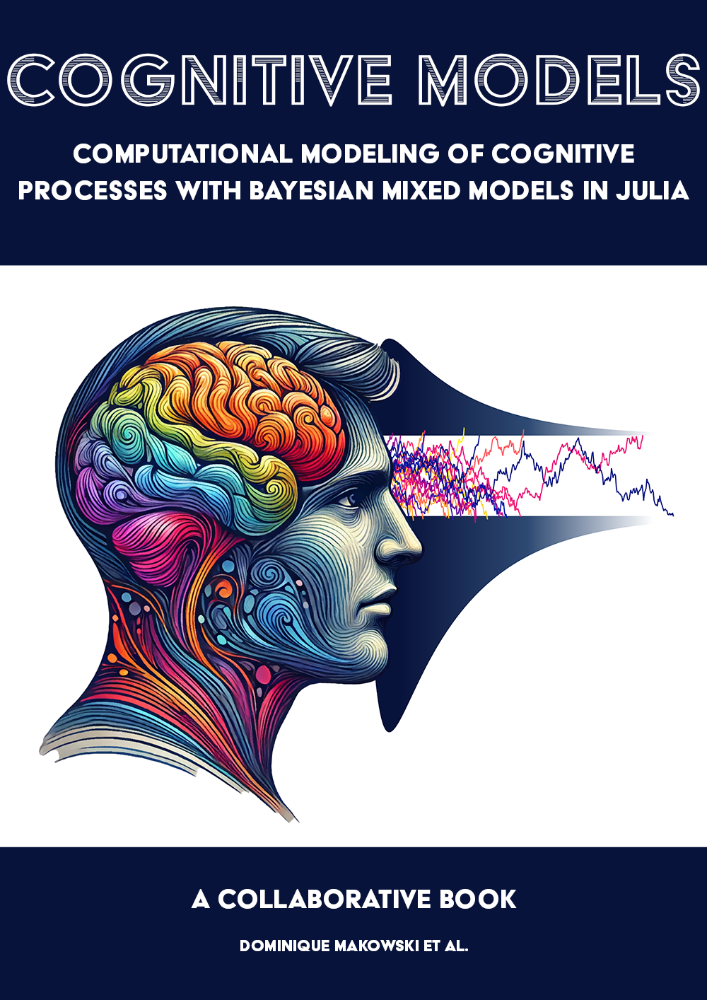

# Cognitive Models 

*Computational Modeling of Cognitive Processes with Bayesian Mixed Models in Julia*

The project is to write an open-access book on **cognitive models**, i.e., statistical models that best fit **psychological data** (e.g., reaction times, scales from surveys, ...). 
This framework aims at moving away from a mere description of the data, to make inferences about the underlying cognitive processes that led to its generation.

## Why Julia?

[**Julia**](https://julialang.org/) - the new cool kid on the scientific block - is a modern programming language with many benefits when compared with R or Python.
Importantly, it is currently the only language in which we can fit all the cognitive models under a Bayesian framework using a unified interface like [**Turing**](https://turing.ml/) and [**SequentialSamplingModels**](https://github.com/itsdfish/SequentialSamplingModels.jl).

## Why Bayesian?

Unfortunately, cognitive models often involve distributions for which Frequentist estimations are not yet implemented, and usually contain a lot of parameters (due to the presence of **random effects**), which makes traditional algorithms fail to converge.
Simply put, the Bayesian approach is the only one currently robust enough to fit these complex models.

## Looking for Coauthors

As this is a fast-evolving field (both from the theoretical - with new models being proposed - and the technical side - with improvements to the packages and the algorithms), the book needs to be future-resilient and updatable by contributors to keep up with the latest best practices. 

This project can only be achieved by a team, and I suspect no single person has currently all the skills and knowledge to cover all the content. We need many people who have strengths in various aspects, such as Julia/Turing, theory, writing, making plots etc.
Most importantly, this project can serve as a way for us to learn more about this approach to psychological science. 

**If you are *interested* in the project, you can let us know by [opening an issue](https://github.com/DominiqueMakowski/CognitiveModels/issues) or getting in touch.**

## Content

See current WIP [**table of content**](https://dominiquemakowski.github.io/CognitiveModels/).

- Fundamentals of Bayesian Modeling in Julia
- On Predictors
- Choices and Scales
- Reaction Times
  - [**Descriptive Models**](https://dominiquemakowski.github.io/CognitiveModels/4a_rt_descriptive.html)
  - [**Generative Models**](https://dominiquemakowski.github.io/CognitiveModels/4b_rt_generative_.html)
- Individual Differences