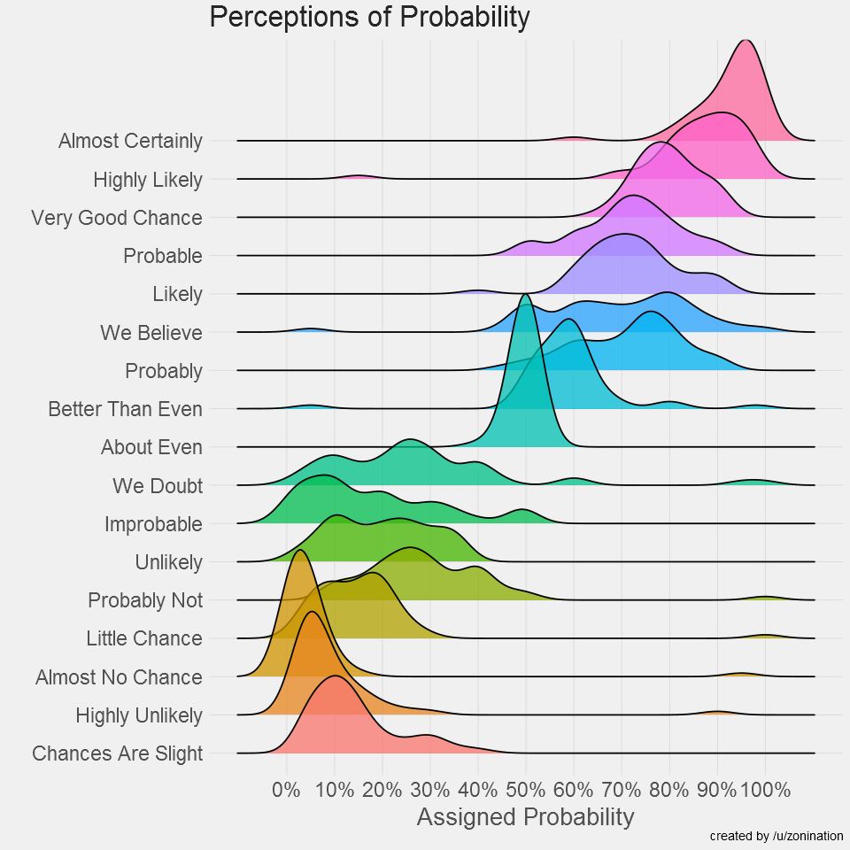

# Cognitive Models with Julia

The project is to write an open-access book on **cognitive models**, i.e., statistical models that best fit **psychological data** (e.g., reaction times, scales from surveys, ...). 
This framework aims at moving away from a mere description of the data, to make inferences about the underlying cognitive processes that led to its generation.

## Why Julia?

[**Julia**](https://julialang.org/) - the new cool kid on the scientific block - is a modern programming language with many benefits when compared with R or Python.
Importantly, it is currently the only language in which we can fit all the cognitive models under a Bayesian framework using a unified interface like [**Turing**](https://turing.ml/).

## Why Bayesian?

Unfortunately, cognitive models often involve distributions for which Frequentist estimations are not yet implemented, and usually contain a lot of parameters (due to the presence of **random effects**), which makes traditional algorithms fail to converge.
Simply put, the Bayesian approach is the only one currently robust enough to fit these somewhat complex models.

## The Plan

As this is a fast-evolving field (both from the theoretical - with new models being proposed - and the technical side - with improvements to the packages and the algorithms), the book needs to be future-resilient and updatable to keep up with the latest best practices. 

- [ ] Decide on the framework to build the book in a reproducible and collaborative manner (Quarto?)
- [ ] Set up the infrastructure to automatically build it using GitHub actions and host it on GitHub pages
- [ ] Write the content of the book
- [ ] Referencing
  - Add Zenodo DOI and reference (but how to deal with evolving author? Through versioning?)
  - Publish a paper to present the book project ([JOSE](https://jose.theoj.org/))?

## Looking for Coauthors

This project can only be achieved by a team, and I suspect no single person has currently all the skills and knowledge to cover all the content. We need many people who have strengths in various aspects, such as Julia/Turing, theory, writing, making plots etc.
Most importantly, this project can serve as a way for us to learn more about this approach to psychological science. 

**If you are *interested* in the project, you can let us know by [opening an issue](https://github.com/DominiqueMakowski/CognitiveModels/issues) or getting in touch.**

## Content

Remains to be decided. Some ideas:

### Chapter 1: Pieces of Puzzle

1. Very quick intro to Julia and Turing
2. Linear Regression: understand what the parameters mean (intercept, slopes, sigma)
3. Boostrapping: Introduce concepts related to pseudo-posterior distribution description
4. Hierarchical Models: Simpson's paradox, random effects, how to leverage them to model interindividual differences
5. Bayesian estimation: introduce Bayesian estimation and priors over parameters
6. Bayesian mixed linear regression: put everything together

### Chapter 2: Predictors

#### Categorical predictors (Condition, Group, ...)

Nested interactions, contrasts, ...

#### Ordered predictors (Likert Scales)

Likert scales, i.e., ordered multiple *discrete* choices are often used in surveys and questionnaires. While such data is often treated as a *continuous* variable, such assumption is not necessarily valid. Indeed, distance between the choices is not necessarily equal. For example, the difference between "strongly agree" and "agree" might not be the same as between "agree" and "neutral". Even when using integers like 1, 2, 3, 4; people might implicitly process "4" as more extreme relative to "3" as "3" to "2".

> The probabilities assigned to discrete probability descriptors are not necessarily equidistant (https://github.com/zonination/perceptions)

What can we do to better reflect the cognitive process underlying a Likert scale responses? [Monothonic effects](https://cran.r-project.org/web/packages/brms/vignettes/brms_monotonic.html).

#### Interactions

Todo. 

#### Non-linear relationships (polynomial, GAMs)

Todo. 

### Chapter 3: Choice and Scales

1. Logistic models for binary data
2. Beta models 
3. OrdBeta models for slider scales

### Chapter 4: Reaction Times

#### Descriptive Models (ExGaussian, LogNormal, Wald)

##### The Problem with Linear Models

Linear models, by definition, will try to predict the *mean* of the outcome variable by estimating the "best fitting" *Normal* distribution. In the context of reaction times (RTs), this is not ideal, as RTs typically exhibit a non-normal distribution, skewed towards the left with a long tail towards the right. This means that the parameters of a Normal distribution (mean $\mu$ and standard deviation $\sigma$) are not good descriptors of the data.

> Linear models try to find the best fitting Normal distribution for the data. However, for reaction times, even the best fitting Normal distribution (in red) does not capture well the actual data (in grey).

Rather than applying arbitrary data transformation, such as a log-transform (which leads to a loss of power, **REFs**), it would be better to swap the Normal distribution for a more appropriate one that can better capture the characteristics of a RT distribution.

##### Bayesian Linear Model in Julia

Write it...

##### LogNormal

#### Generative Models (DDM)

Use DDM as a case study to introduce generative models

#### Other Models

### Chapter 5: Individual Parameters

1. From mixed models
2. As prior-informed individual Bayesian models